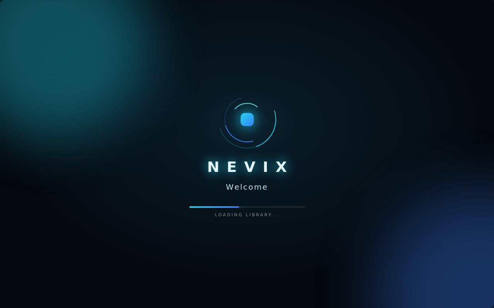
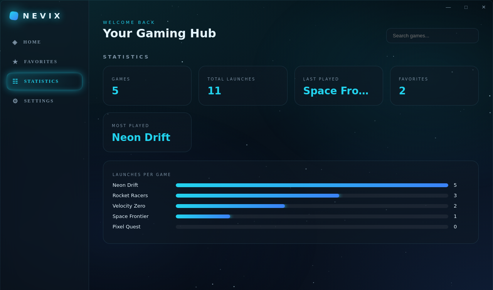

<div align="center">

# NEVIX

**A futuristic game launcher for Windows.**
Dark glass UI, aqua glow, one-click launching for all your games, whatever store they came from.

[English](README.md) · [Polski](README.pl.md)


</div>

## Features

- **One library for everything**: game cards with icons, favorites, live search and launch statistics.
- **PC scan**: finds installed games from Steam (all libraries), Epic Games, GOG, Riot, Xbox, EA, Ubisoft, Battle.net, Minecraft Launcher, Roblox and common `Games` folders. You choose what to import.
- **Quick Drop**: drag a shortcut (`.url`, `.lnk`) or an `.exe` anywhere into the window and the game is added.
- **Steam-aware launching**: Steam games start through Steam (`steam://rungameid/...`), exactly like a desktop shortcut, instead of failing with a console window when the bare exe is started.
- **Self-repair**: if a launch fails, NEVIX looks for the moved game, tries launching through Windows (UAC prompts, app aliases) and, as a last resort, asks you to point it to the exe.
- **Game icons**: extracted from the game's exe, or pick your own image with the ICON button.
- **Game Mode**: while a game runs, NEVIX lowers its own priority and freezes animations, glass effects and polling when it is not the focused window.
- **System monitor**: real CPU and RAM. GPU usage, temperature and VRAM on NVIDIA cards (usage only on other GPUs). FPS is NEVIX's own render rate.
- **Animated sky**: twinkling stars and shooting stars behind the UI (switchable in Settings).
- **Welcome screen** with your name, accent colors, start with Windows, minimize to tray.

<div align="center">


</div>

## Download

Grab `NEVIX.exe` from the [Releases](../../releases) page. It is a single portable file, with no installer. Just run it.

> **Windows SmartScreen warning:** NEVIX is not code-signed (a certificate costs money), so Windows may show "Unknown publisher". Click **More info → Run anyway**. The whole source is in this repository, and you can build the exe yourself.

## Run from source

Requirements: [Node.js](https://nodejs.org) 20+ on Windows.

```bash
npm install
npm start
```

Build the portable exe (written to `release/NEVIX.exe`):

```bash
npm run dist
```

Pushing a tag like `v1.5.0` builds the exe on GitHub Actions and attaches it to a Release (see `.github/workflows/build.yml`).

## Your data

Everything stays on your PC: no accounts, no telemetry.

- Library and settings: `%APPDATA%\NEVIX\library.json` (a damaged file is backed up, not lost)
- Extracted/custom icons: `%APPDATA%\NEVIX\icons\`

NEVIX starts other programs only when you press LAUNCH. For monitoring it calls `tasklist` (Game Mode) and `nvidia-smi` or PowerShell (GPU stats). Launcher links are limited to an allowlist (`steam://`, Epic, GOG Galaxy, Ubisoft, EA, Battle.net).

## Project layout

```
main.js       Electron main process: library, launching, self-repair, Quick Drop, Game Mode
preload.js    contextBridge API (contextIsolation on, sandbox on, no nodeIntegration)
scanner.js    PC scan + Steam helpers
gpu.js        GPU stats (nvidia-smi / WMI)
renderer/     UI (index.html, style.css, app.js)
```

## Known limitations

- Windows only.
- GPU temperature works on NVIDIA only; other vendors don't expose it without vendor tools.
- Game Mode detects Steam-launched games by their exe name. If a game uses a different process, NEVIX simply stops assuming it runs after a couple of minutes.
- Early version: bug reports are welcome (please include your GPU and which launcher the game uses).

## Ideas

Playtime tracking, big cover images, library backup/import, auto-update, gamepad navigation, Discord Rich Presence.

## License

[MIT](LICENSE) © MrPolishAv1x0
