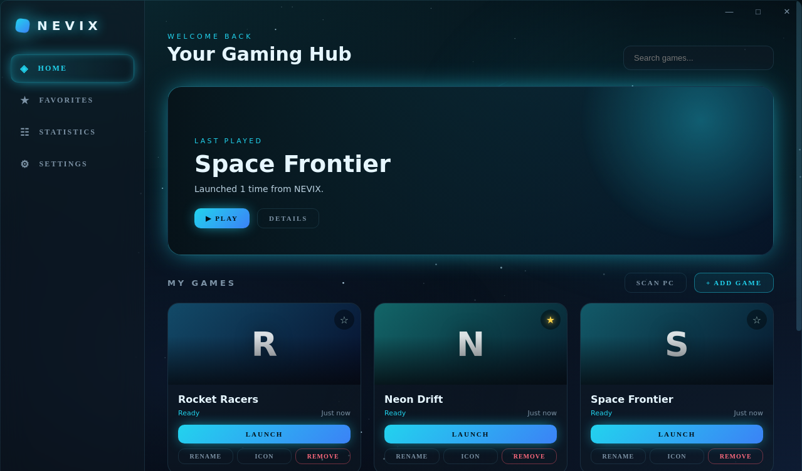

<div align="center">

# NEVIX

**Futurystyczny launcher gier na Windows.**
Ciemny, szklany interfejs z aqua glow i odpalanie wszystkich gier jednym kliknięciem, niezależnie od sklepu.

[English](README.md) · [Polski](README.pl.md)



</div>

## Funkcje

- **Jedna biblioteka**: karty gier z ikonami, ulubione, wyszukiwarka na żywo i statystyki uruchomień.
- **Skan komputera**: znajduje gry ze Steama (wszystkie biblioteki), Epic Games, GOG, Riot, Xbox, EA, Ubisoft, Battle.net, Minecraft Launcher, Robloxa i zwykłych folderów `Games`. Sam wybierasz, co zaimportować.
- **Quick Drop**: przeciągnij skrót (`.url`, `.lnk`) albo `.exe` w dowolne miejsce okna, a gra się doda.
- **Gry ze Steama przez Steam**: startują przez `steam://rungameid/...`, jak skrót z pulpitu, zamiast wywalać okno konsoli po odpaleniu samego `.exe`.
- **Samonaprawa**: gdy start się nie uda, NEVIX szuka przeniesionej gry, próbuje odpalić ją przez Windows (UAC, aliasy aplikacji), a na końcu prosi o wskazanie pliku `.exe`.
- **Ikony gier**: pobierane z `.exe` gry albo własny obrazek przyciskiem ICON.
- **Game Mode**: gdy gra działa, NEVIX obniża swój priorytet i zatrzymuje animacje, efekty szkła i odświeżanie, jeśli nie jest aktywnym oknem.
- **Monitor systemu**: prawdziwe CPU i RAM. Na kartach NVIDIA także użycie GPU, temperatura i VRAM (na innych kartach samo użycie). FPS to szybkość renderowania samego NEVIX.
- **Animowane niebo**: migoczące i spadające gwiazdy w tle (do wyłączenia w ustawieniach).
- **Ekran powitalny** z Twoim imieniem, kolory akcentu, start z Windows, minimalizacja do traya.

## Pobieranie

Pobierz `NEVIX.exe` ze strony [Releases](../../releases). To jeden plik przenośny, bez instalatora. Wystarczy go uruchomić.

> **Ostrzeżenie Windows SmartScreen:** NEVIX nie jest podpisany certyfikatem (to płatne), więc Windows może pokazać „Nieznany wydawca”. Kliknij **Więcej informacji → Uruchom mimo to**. Cały kod jest w tym repozytorium, więc możesz zbudować plik sam.

## Uruchomienie z kodu

Wymagania: [Node.js](https://nodejs.org) 20+ na Windows.

```bash
npm install
npm start
```

Budowanie przenośnego exe (powstaje `release/NEVIX.exe`):

```bash
npm run dist
```

Wypchnięcie tagu, np. `v1.5.0`, buduje exe na GitHub Actions i dodaje je do Release (patrz `.github/workflows/build.yml`).

## Twoje dane

Wszystko zostaje na Twoim komputerze: bez kont i bez telemetrii.

- Biblioteka i ustawienia: `%APPDATA%\NEVIX\library.json` (uszkodzony plik jest kopiowany, a nie tracony)
- Ikony: `%APPDATA%\NEVIX\icons\`

## Ograniczenia

- Tylko Windows.
- Temperatura GPU działa tylko na NVIDIA.
- Game Mode rozpoznaje gry ze Steama po nazwie pliku `.exe`. Jeśli gra używa innego procesu, NEVIX po kilku minutach przestaje zakładać, że działa.
- To wczesna wersja: zgłoszenia błędów mile widziane (podaj kartę graficzną i launcher, z którego odpalasz grę).

## Licencja

[MIT](LICENSE) © MrPolishAv1x0
